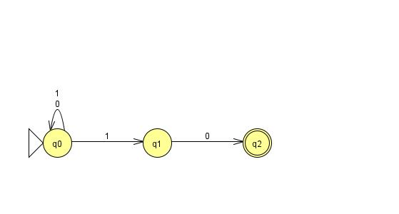
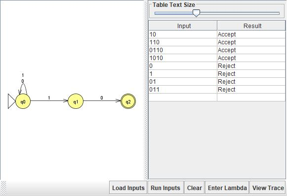

# Problem 7: Σ = {0,1}, L = {s | s ends with "10"}

## NFA Design

N = (Q, Σ, δ, q0, F):
- Q = {q0, q1, q2}
- Σ = {0, 1}
- q0 = q0 (start)
- F = {q2}
- δ(q0, 0) = {q0}, δ(q0, 1) = {q0, q1}, δ(q1, 0) = {q2}, δ(q1, 1) = ∅

**Idea:** N nondeterministically guesses where the final "10" begins. At each 1, one branch stays at q0 (guessing this isn't the start of the suffix) while another moves to q1 (guessing it is). The guess is correct only if that branch then reads exactly one more symbol, 0, landing in q2. Since q2 has no outgoing transitions, any guess made too early dies off as soon as more input follows. N accepts iff some branch's guess was correct, i.e. iff w truly ends in "10".

## Diagram

## Test Strings

See `n07t.txt`. Accepted: 10, 110, 0110, 1010. Rejected: 0, 1, 01, 011.

## Batch Run

## Computation Tree (if needed)

No surprises here. All batch results matched what I expected on the first run, so I traced Problems 11, 23, and 24 step by step instead.
