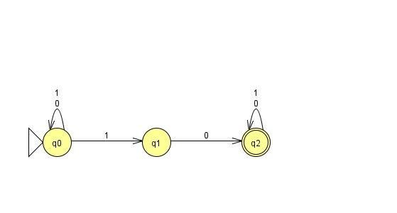
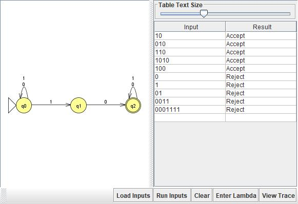

# Problem 9: Σ = {0,1}, L = {s | s contains the substring "10"}

## NFA Design

N = (Q, Σ, δ, q0, F):
- Q = {q0, q1, q2}
- Σ = {0, 1}
- q0 = q0 (start)
- F = {q2}
- δ(q0, 0) = {q0}, δ(q0, 1) = {q0, q1}, δ(q1, 0) = {q2}, δ(q1, 1) = ∅, δ(q2, 0) = {q2}, δ(q2, 1) = {q2}

**Idea:** Same guessing structure as Problem 7, except q2 self-loops on both symbols — once "10" has been found anywhere in the string, the rest of the string no longer matters for acceptance.

## Diagram

## Test Strings

See `n09t.txt`. Accepted: 10, 010, 110, 1010, 100. Rejected: 0, 1, 01, 0011, 0001111 (strings with no 1 immediately followed by a 0).

## Batch Run

## Computation Tree (if needed)

No surprises here. All batch results matched what I expected on the first run, so I traced Problems 11, 23, and 24 step by step instead.
