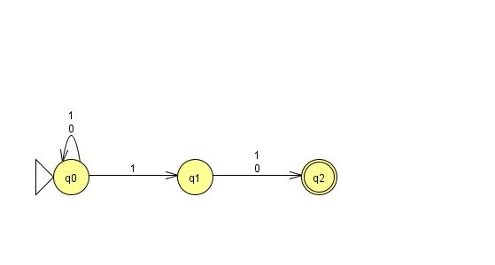
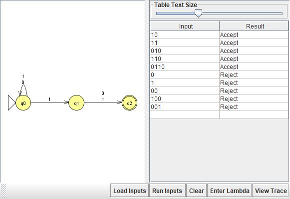
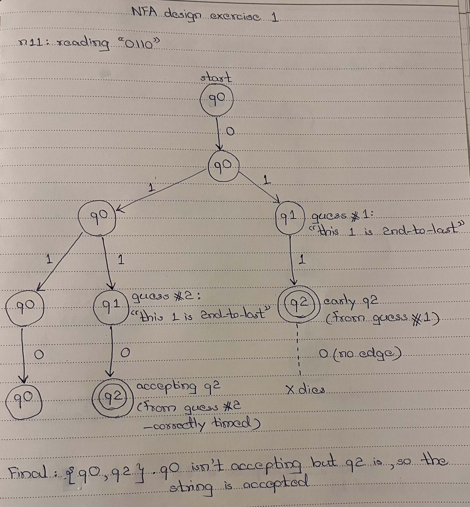
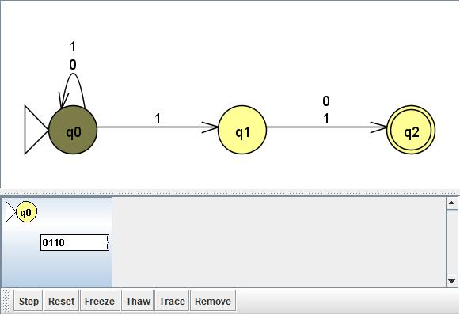
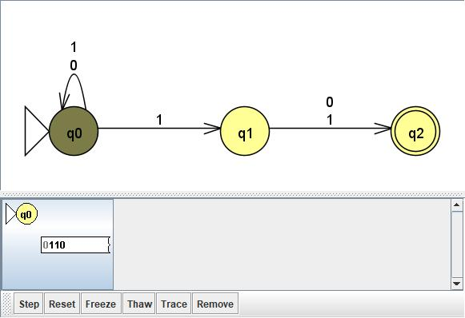
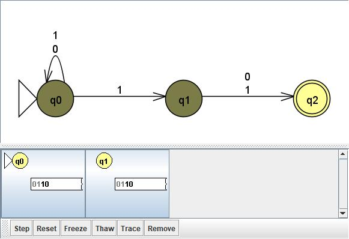
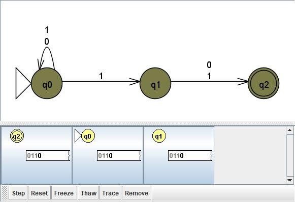
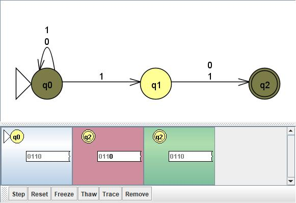

# Problem 11: Σ = {0,1}, L = {s | the 2nd-to-last symbol of s is 1}

## NFA Design

N = (Q, Σ, δ, q0, F):
- Q = {q0, q1, q2}
- Σ = {0, 1}
- q0 = q0 (start)
- F = {q2}
- δ(q0, 0) = {q0}, δ(q0, 1) = {q0, q1}, δ(q1, 0) = {q2}, δ(q1, 1) = {q2}

**Idea:** N guesses which symbol is 2nd-to-last. Reading a 1, one branch guesses "this is it" (→ q1); from q1, reading exactly one more symbol (either value) lands in q2. Since q2 has no further transitions, the guess only survives if exactly one symbol remains after it — i.e. the guessed symbol really was 2nd-to-last.

## Diagram

## Test Strings

See `n11t.txt`. Accepted: 10, 11, 010, 110, 0110. Rejected: 0, 1, 00, 100, 001 (too short, or 2nd-to-last symbol is 0).

## Batch Run

## Computation Tree (if needed)

I traced "0110" because it shows the guessing in action. Every time the NFA reads a 1, it splits off a branch that guesses "this is the 2nd-to-last symbol." Guesses made too early reach q2 with input still left and die there, because q2 has no outgoing transitions.

### Hand-drawn computation tree

### JFLAP step-by-step (Input → Step by State)

| Step | Read so far | Current states |
|---|---|---|
| 0 | ε | {q0} |
| 1 | 0 | {q0} |
| 2 | 01 | {q0, q1} |
| 3 | 011 | {q0, q1, q2} |
| 4 | 0110 | {q0, q2} → accept |

At step 3, the q2 branch came from guessing the first 1 was 2nd-to-last. That guess is wrong, and the branch dies on the next symbol. The q2 at step 4 comes from the second 1, which really is 2nd-to-last, so the string is accepted.

In the step 4 screenshot, JFLAP shows this directly: the early q2 is red (dead, with the last 0 still unread), the correct q2 is green (accepted), and q0 is neither.

