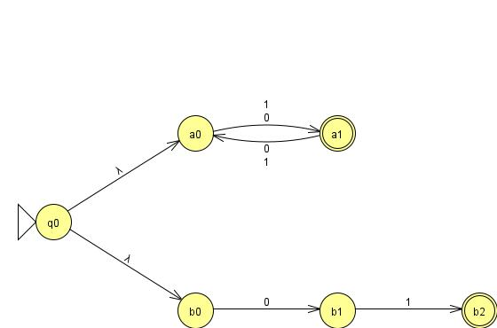
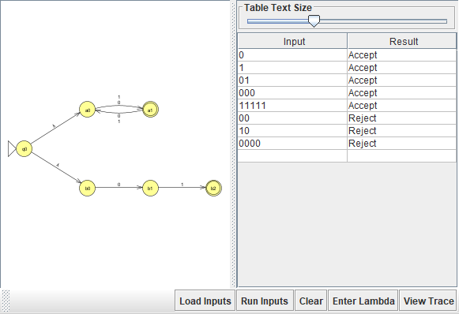

# Problem 23: Σ = {0,1}, L = {s | |s| is odd} ∪ {"01"}

## NFA Design

N = (Q, Σ, δ, q0, F), built by ε-branching into two independent sub-machines:

- Q = {q0, a0, a1, b0, b1, b2}
- Σ = {0, 1}
- q0 = q0 (start, new)
- δ(q0, ε) = {a0, b0}
- **Odd-length branch:** δ(a0, 0) = {a1}, δ(a0, 1) = {a1}, δ(a1, 0) = {a0}, δ(a1, 1) = {a0}
- **Exact-"01" branch:** δ(b0, 0) = {b1}, δ(b1, 1) = {b2} (all other entries ∅)
- F = {a1, b2}

**Idea:** At the start, N forks via ε into both branches at once. The odd-length branch (a0/a1) just flips parity on every symbol, accepting iff it lands on a1 (odd count read). The exact-match branch (b0→b1→b2) only survives on the literal string "01" and dies on any deviation, since it has no self-loops. N accepts iff either branch ends in its accept state.

## Diagram

## Test Strings

See `n23t.txt`. Accepted: 0, 1, 01, 000, 11111 (0, 1, 000, and 11111 have odd length; "01" is accepted via the exact-match b-branch, not the odd-length a-branch. It has even length, so this is good evidence the b-branch is actually doing work). Rejected: "" (empty), 00, 10, 0000 (all even length, none equal to "01").

## Batch Run

## Computation Tree (if needed)

When I first batch-tested n23.jff, I accidentally loaded `n07t.txt` (the test file from Problem 7) instead of `n23t.txt`, so "0110" showed up as rejected and it looked like my NFA had a bug. After re-running with the correct `n23t.txt`, all 8 results matched the design exactly: the odd-length strings and the exact string "01" were accepted, and everything else was rejected. So the NFA itself was correct. The problem was a mismatched test file, not the automaton's logic.
