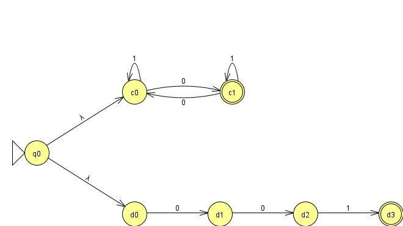
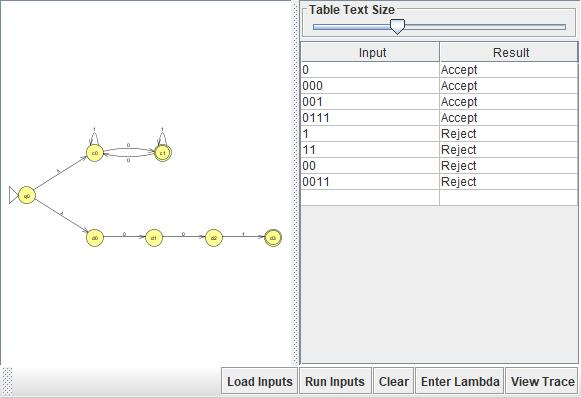
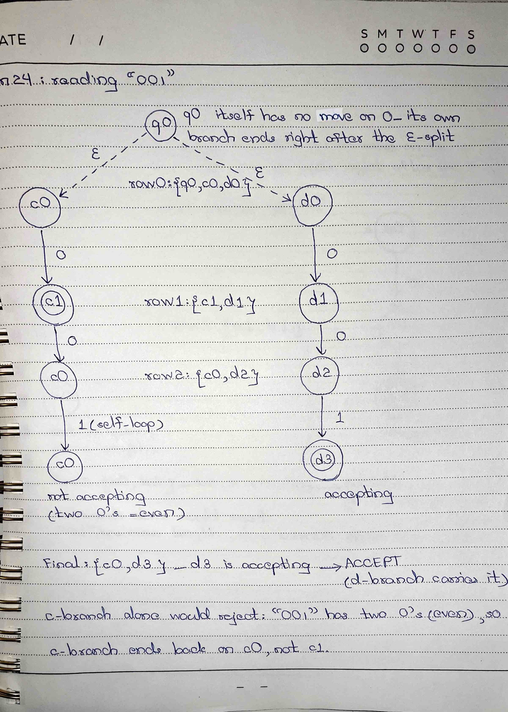
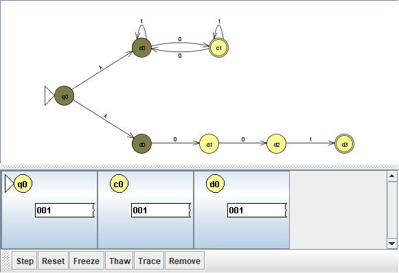
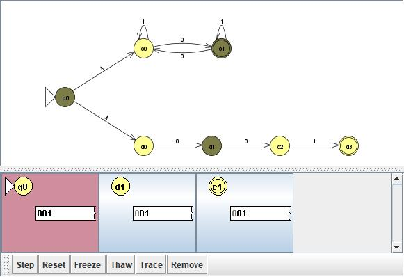
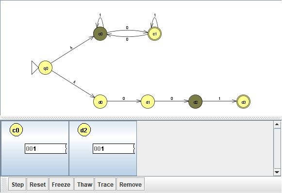
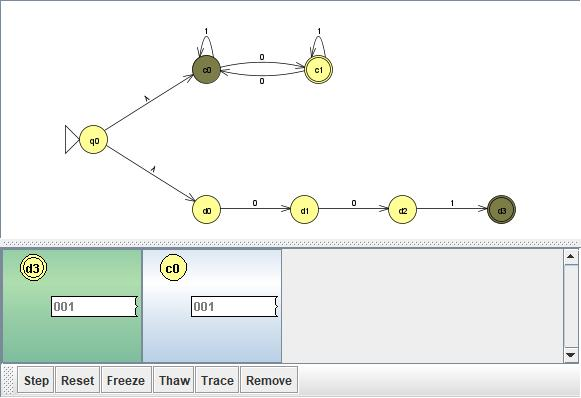

# Problem 24: Σ = {0,1}, L = {s | the number of 0's in s is odd} ∪ {"001"}

## NFA Design

N = (Q, Σ, δ, q0, F):

- Q = {q0, c0, c1, d0, d1, d2, d3}
- Σ = {0, 1}
- q0 = q0 (start, new)
- δ(q0, ε) = {c0, d0}
- **Odd-#-of-0's branch:** δ(c0, 0) = {c1}, δ(c0, 1) = {c0}, δ(c1, 0) = {c0}, δ(c1, 1) = {c1}
- **Exact-"001" branch:** δ(d0, 0) = {d1}, δ(d1, 0) = {d2}, δ(d2, 1) = {d3} (all other entries ∅)
- F = {c1, d3}

**Idea:** Same union-via-ε-branching technique as Problem 23. The c-branch counts 0's mod 2 and accepts on odd; the d-branch only survives on the exact literal string "001".

## Diagram

## Test Strings

See `n24t.txt`. Accepted: 0, 000, 001, 0111 (odd # of 0's, or exactly "001"). Rejected: "" (empty), 1, 11, 00, 0011 (even # of 0's, and not "001").

## Batch Run

## Computation Tree (if needed)

I traced "001" because it has an even number of 0's, so the c-branch alone would reject it. It is accepted only by the exact-match d-branch.

### Hand-drawn computation tree

### JFLAP step-by-step (Input → Step with Closure)

| Step | Read so far | Current states |
|---|---|---|
| 0 | ε | {q0, c0, d0} |
| 1 | 0 | {c1, d1} |
| 2 | 00 | {c0, d2} |
| 3 | 001 | {c0, d3} → accept |

After two 0's the c-branch is back in c0 (even, not accepting), and it stays in c0 on the final 1. The d-branch follows d0 → d1 → d2 → d3 exactly, so the string is accepted through d3.

In the screenshots, JFLAP colors a dead configuration red and an accepting one green. At step 1, q0 turns red because it has no move on 0, and at step 3, d3 turns green.

